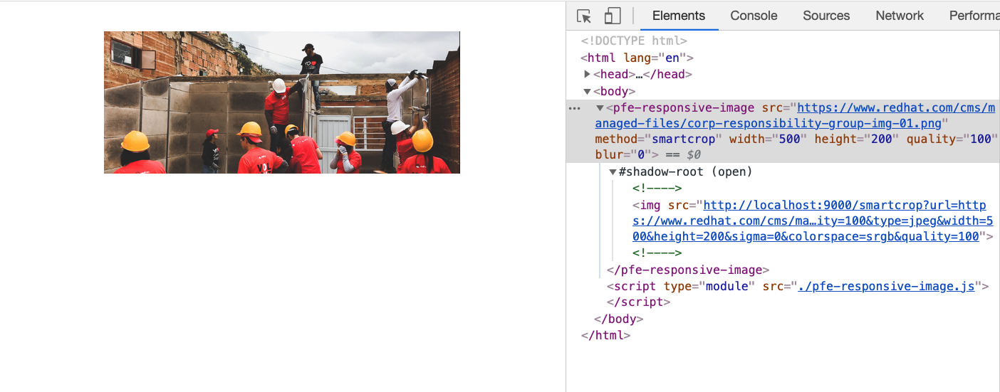

# Responsive Image Microservice Demo



This is an example of a web component that can dynamically generate new images using a microservice backend.  [Imaginary](https://github.com/h2non/imaginary) is a fantastic open source project that handles all of your image resizing needs as an API.

## How to get this running?

### Start the Imaginary service

```
docker-compose up
```

### Start a local server

```
npx serve .
```

Visit http://localhost:5000 in your browser.